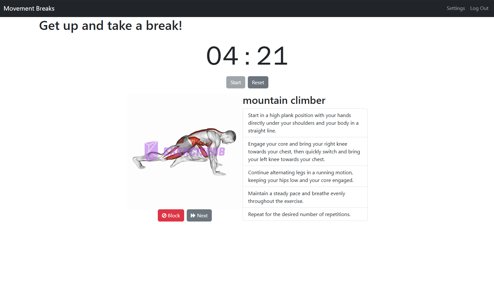

# Movement Breaks
Sitting all day is not good for your health, and most people are not moving much while they work (or sometimes when they aren’t working too!). Movement Breaks is a customizable productivity timer to encourage focusing for a specified period of time, and then taking breaks to move around by following suggested exercises. 

## Features
* Productivity timer with exercise suggestions including exercise name, image, and detailed instructions. 
* Default settings: the timer is set to 60 minutes of work with a 5 minute break and only body weight exercises are shown. 
* User accounts which unlock the ability to customize settings.
    * Adjustable work and break lengths for timer.
    * Add equipment owned (dumbbells, resistance bands, etc.) to include additional exercises options.
    * Specify target areas (abs, cardio, etc.) to further customize exercise suggestions.
    * Block disliked exercises.

## User Flow
* The timer can be used without signing up. Simply press start to begin the count down.
* Otherwise, users can log in using the navigation bar. From the log in page, they can register if they do not have an account.
* After logging in, users can modify their settings from the navigation bar. Here they can set their preferred timer lengths (for instance 25 minute work periods and 5 minute break periods for a Pomodoro style timer). They can also select any exercise equipment they own and which areas they are interested in focusing on exercising, if any. 
* The timer will now be adjusted to their preferences. During break times, exercises will be displayed with images and instructions. Users can move on to another exercise at any time. They can also block any exercise to avoid it showing up again in the future. 
* Reset the timer after the break and repeat as needed to get work done. 
* If at any point, the user's settings result in no exercises meeting their preferences, the site will show default body weight exercises again and suggest the user make adjustments to their settings. 

## API
ExerciseDB API: https://rapidapi.com/justin-WFnsXH_t6/api/exercisedb

The site uses data from the ExerciseDB API. Initially, it fetched data directly from the API, but now it uses its own database that is seeded from the API. This was done to enable the blocking functionality. 

## Technology
* Python
* Flask
* SQLAlchemy
* JavaScript
* jQuery
* Bootstrap
